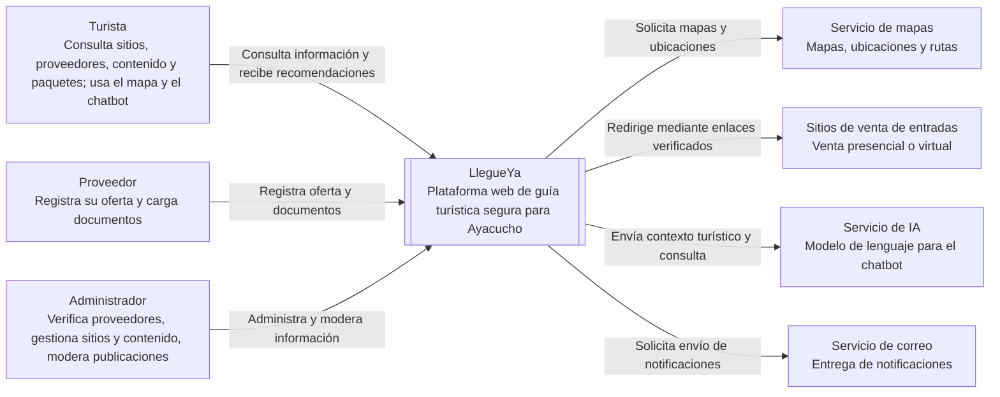

# Nivel 1 - Diagrama de contexto del sistema

## Objetivo

Mostrar a LlegueYa como un sistema único y sus relaciones con las personas y sistemas externos que lo rodean. El sistema no vende entradas ni procesa pagos: únicamente presenta puntos de venta verificados y redirige al turista.

## Descripción de las relaciones

| Elemento | Relación con LlegueYa |
|---|---|
| Turista | Consulta sitios arqueológicos, accesos, proveedores verificados, reseñas, fotos, historias, libros y paquetes. También puede iniciar sesión, publicar contenido y usar el chatbot. |
| Proveedor | Registra hospedajes, restaurantes o servicios de transporte y carga la documentación necesaria para ser verificado. |
| Administrador | Verifica o suspende proveedores, registra sitios y puntos de venta, gestiona contenido turístico y modera reseñas y fotos. |
| Servicio de mapas | Proporciona mapas y ubicación de sitios, puntos de venta y proveedores. |
| Sitios de venta de entradas | Reciben al turista mediante un enlace presencial o virtual previamente registrado y verificado. LlegueYa no cobra entradas. |
| Servicio de IA | Genera respuestas del chatbot usando la base de conocimiento turística de LlegueYa. |
| Servicio de correo | Envía avisos cuando se publica nuevo contenido turístico. |

## Alcance y límites

- **Dentro de LlegueYa:** guía turística, proveedores verificados, reseñas, fotos de experiencias, contenido cultural, paquetes, chatbot web y notificaciones.
- **Fuera de LlegueYa:** cobro de entradas, pasarela de pagos, emisión de boletos, control de aforo y chatbot por WhatsApp o Telegram.

## Trazabilidad

Este nivel refleja RF01-RF21, RC04-RC10, HU01-HU19 y ADR-006/ADR-009.
