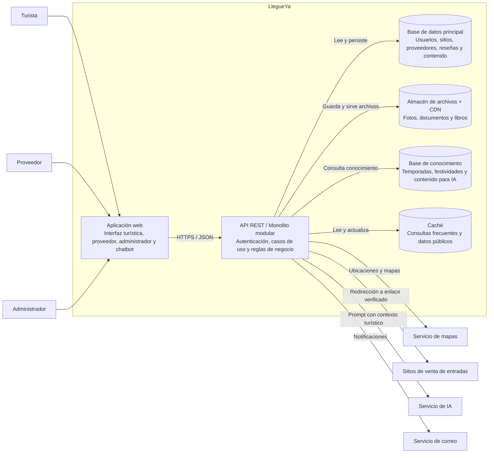

# Nivel 2 - Diagrama de contenedores

## Objetivo

Descomponer el sistema en contenedores desplegables o ejecutables. La propuesta conserva el estilo de monolito modular: la aplicación web y la API forman parte de una solución que puede desplegarse junto con sus servicios de datos y archivos.

## Contenedores

| Contenedor | Responsabilidad | Relaciones principales |
|---|---|---|
| Aplicación web | Presentar sitios, mapas, proveedores, contenido, paquetes, autenticación, paneles y chatbot web. | Es utilizada por los tres actores y consume la API REST. |
| API REST / monolito modular | Exponer endpoints, autenticar y autorizar por rol, ejecutar casos de uso y aplicar las reglas del dominio. | Accede a datos mediante puertos y coordina las integraciones externas. |
| Base de datos principal | Persistir usuarios, roles, sitios, puntos de venta, proveedores, estados de verificación, reseñas, fotos y publicaciones. | Es consultada por la API. |
| Almacén de archivos + CDN | Guardar y distribuir fotos, documentos de proveedores y libros sin cargar archivos pesados en la base de datos. | Es utilizado por la API y sirve contenido estático al navegador. |
| Base de conocimiento | Contener información turística curada, festividades, temporadas y datos usados por las recomendaciones. | Es consultada por el chatbot y actualizada por el administrador. |
| Caché | Reducir latencia en sitios, proveedores aprobados, puntuaciones y consultas de alta frecuencia. | Es administrada por la API; debe invalidarse cuando cambian datos relevantes. |

## Decisiones reflejadas

- Monolito modular y escalamiento horizontal: ADR-001.
- Separación de reglas y tecnología mediante Clean Architecture: ADR-002.
- Caché y archivos/CDN: ADR-003 y ADR-004.
- Integraciones externas mediante adaptadores: ADR-005.
- API REST con autenticación y autorización por roles: ADR-009.

Los nombres de tecnologías concretas quedan abiertos; este diagrama describe responsabilidades, no una implementación tecnológica definitiva.
