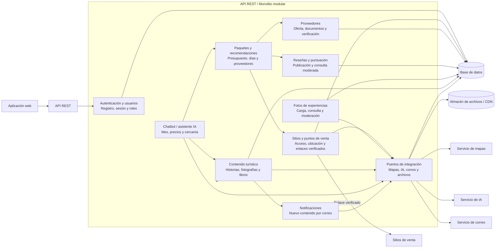

# Nivel 3 - Diagrama de componentes

## Objetivo

Mostrar los componentes principales dentro de la API REST / monolito modular. Todos pertenecen a la misma aplicación, pero se separan por responsabilidad para facilitar mantenimiento, pruebas y una futura extracción de módulos.

## Componentes y responsabilidades

| Componente | Responsabilidad | Requisitos |
|---|---|---|
| Autenticación y usuarios | Registro, inicio de sesión y autorización para turista, proveedor y administrador. | RF01 |
| Sitios y puntos de venta | Consultar sitios, acceso, distancias, puntos físicos y enlaces virtuales verificados. | RF02-RF04, RF19 |
| Proveedores | Registrar oferta y documentos; exponer solo proveedores aprobados en consultas y paquetes. | RF05, RF17, RF18 |
| Reseñas y puntuación | Registrar y consultar puntuaciones y comentarios asociados a usuarios; gestionar su moderación. | RF06, RF07, RF21 |
| Fotos de experiencias | Guardar metadatos, almacenar archivos y controlar el estado de moderación. | RF08, RF09, RF21 |
| Contenido turístico | Gestionar historias, fotografías y libros publicados por el administrador. | RF10-RF12, RF20 |
| Paquetes y recomendaciones | Armar propuestas de movilidad, hospedaje y restaurantes según días y presupuesto. | RF13 |
| Chatbot / asistente IA | Consultar contexto turístico y solicitar recomendaciones de paquete, mes y proveedores cercanos. | RF14-RF16 |
| Notificaciones | Detectar nuevo contenido y solicitar el envío de correos a usuarios suscritos. | RF12 |
| Puertos de integración | Abstraer persistencia, mapas, IA, correo y almacenamiento de archivos. | ADR-002, ADR-005 |

## Reglas de interacción

1. Los componentes aplican las reglas del dominio y no exponen directamente tablas o proveedores externos a la aplicación web.
2. Un proveedor solo puede ser usado por paquetes, búsquedas y chatbot cuando su estado es `APROBADO`.
3. Un enlace de venta solo puede mostrarse o utilizarse cuando está verificado por el administrador.
4. Reseñas y fotos de usuarios pasan por moderación antes de hacerse visibles.
5. El chatbot recibe información de la base de conocimiento y no reemplaza la validación de proveedores ni de enlaces.
