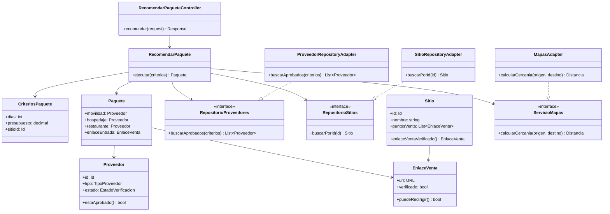

# Nivel 4 - Diagrama de código

## Alcance del nivel

Este nivel es una propuesta de diseño de código para el componente **Paquetes y recomendaciones**, uno de los flujos centrales de LlegueYa. El repositorio todavía no contiene una implementación; por eso las clases, interfaces y métodos siguientes funcionan como guía para construir el monolito modular con Clean Architecture.

## Estructura propuesta

## Organización por Clean Architecture

| Capa | Elementos del ejemplo | Responsabilidad |
|---|---|---|
| Presentación | `RecomendarPaqueteController` | Traducir la petición HTTP, validar formato básico y devolver la respuesta. |
| Aplicación | `RecomendarPaquete`, `CriteriosPaquete`, interfaces de repositorio y `ServicioMapas` | Orquestar el caso de uso mediante puertos, sin depender de una base de datos o proveedor concreto. |
| Dominio | `Paquete`, `Proveedor`, `EnlaceVenta`, `Sitio` | Mantener entidades y reglas: proveedor aprobado y enlace de venta verificado. |
| Infraestructura | `ProveedorRepositoryAdapter`, `SitioRepositoryAdapter`, `MapasAdapter` | Implementar persistencia e integración con servicios externos. |

## Flujo de código principal

1. La aplicación web envía a la API los días, presupuesto y sitio de interés.
2. `RecomendarPaqueteController` transforma la solicitud en `CriteriosPaquete`.
3. `RecomendarPaquete` solicita proveedores aprobados mediante `RepositorioProveedores`.
4. El caso de uso consulta `RepositorioSitios` y obtiene únicamente un `EnlaceVenta` que `puedeRedirigir()`.
5. `ServicioMapas` calcula cercanía mediante un adaptador, sin acoplar el dominio al proveedor de mapas.
6. El caso de uso construye `Paquete` y el controlador devuelve sus datos a la aplicación web.

## Otros casos de uso que deben seguir el mismo patrón

| Caso de uso | Componentes principales |
|---|---|
| Registrar reseña | `RegistrarResenaController`, `RegistrarResena`, `RepositorioResenas`, `ModeracionContenido` |
| Publicar contenido | `PublicarContenido`, `RepositorioContenido`, `AlmacenArchivos`, `NotificadorCorreo` |
| Verificar proveedor | `VerificarProveedor`, `RepositorioProveedores`, `ValidadorDocumentos` |
| Consultar chatbot | `ConsultarChatbot`, `RepositorioConocimiento`, `ServicioIA` |

La dirección de dependencias debe apuntar hacia el dominio: las entidades y casos de uso no deben importar frameworks, controladores, tablas ni SDK de mapas, IA, correo o almacenamiento.
